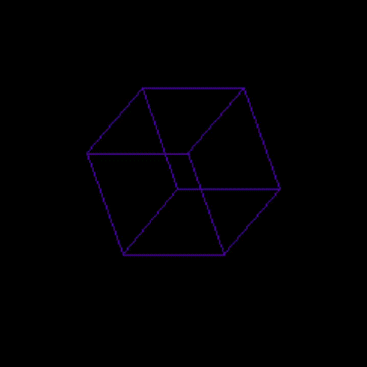
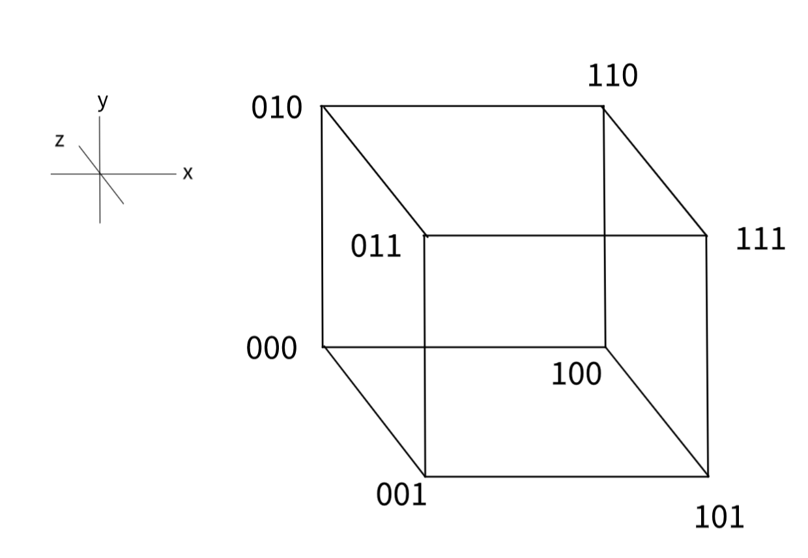
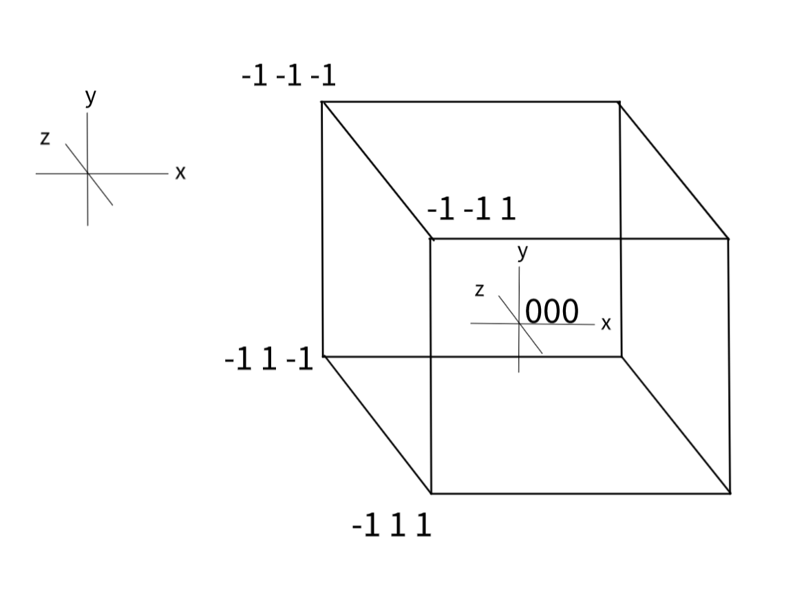
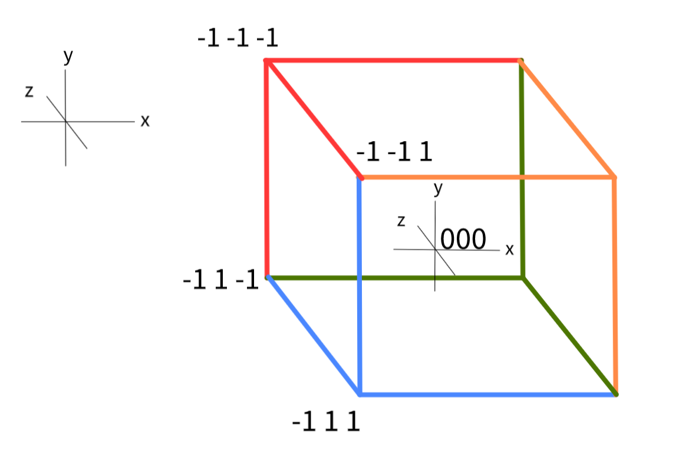
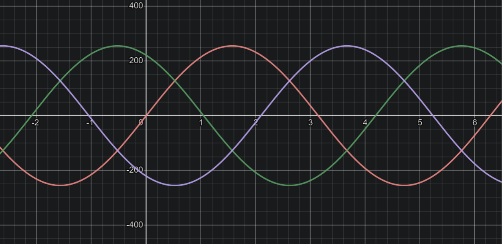

<h1>&nbsp Spinning Cube</h1>
<h3>Matteo Golin</h3>


[](https://opensource.org/licenses/MIT)

## Overview
This repository simply contains a spinning, rainbow cube written entirely in C.

Currently, the cube is projected orthogonally, as I have not implemented a project besides ignoring the Z
values of the cube.

## Controls
- **Mouse click:** The user can click to switch the projection between orthographic and weak
perspective.
- **Scroll wheel:** The user can scroll to change the camera location relative to the cube
in perspective projection mode.
- **WASD/arrow keys:** The user can use WASD/arrow keys to control the rotation of the cube
in real-time.
- **C key:** The `c` key can be used to toggle the user control mode. WASD/arrow keys will enter
user control mode if the cube is currently computer controlled, but `c` must be used in order to return
control to the computer.

## Dependencies
This project requires the SDL2 library.

## Algorithms

### Rotation
The linear algebra for the rotations are explained simply in this
[Stack Overflow post](https://stackoverflow.com/questions/14607640/rotating-a-vector-in-3d-space). See the
selected answer on 3D rotation. I did not implement matrix multiplication for this
operation, but instead expanded out the resulting equations in code for more efficient
calculations.


### Creating the Cube
My original idea centered the cube's back-bottom-left corner at the origin, `(0, 0, 0)`.



Upon doing this, I noticed that the cube's vertex coordinates formed binary digits 0 through 7. So, in order to create
the vertices programmatically, all I needed to do was go through binary digits 0-7 and use the binary representation
of the current digit as the x, y, z components of the vertex's vector.

```C
for (int i = 0; i < 8; i++) {
    for (int i = 0; i < 8; i++) {
        int *bin = to_binary(i); // Binary representation
        cube->vertices[i] = (Vec3D){bin[0], bin[1], bin[2]}; // x, y, z components
}
// Side 3 on the cube is at (x, y, z) of (0, 1, 1). 3 in decimal -> 011 in binary.
```

In order to scale the cube to some initial side length greater than 1, I just needed to multiply the bit by a 
`side_length` variable.
```C
cube->vertices[i] = (Vec3D){bin[0] * side_length, bin[1] * side_length, bin[2] * side_length};
```

Unfortunately, this cube was not centered at the origin, so the rotations looked a little funky. I wanted the cube to
spin around its center, not about its corner.

I then redrew the cube with the origin at its center. Each side length was 2 this time, just so I could maintain my
coordinates as 1s and 0s.



After listing only a few coordinates for this cube, I noticed a pattern:

`(0, 0, 0)` mapped to `(-1, 1, -1)`.

Only one bit switches from `(0, 0, 0)` to `(0, 0, 1)`. `(0, 0, 1)` maps to `(-1, 1, 1)`.

Where that one bit switches in the original coordinates, the new, centered representation of `(0, 0, 0)` also switches
in that same spot. `(-1, 1, -1) --> (-1, 1, 1)`.

This meant a bit switch is equivalent to a sign switch in the centered representation. A 1 in the binary representation
indicates a negative sign, while a 0 indicates a positive sign. These signs are applied to the base case of `(0, 0, 0)`,
 which is `(-1, 1, -1)` when centered.

The equation I derived to multiply the coordinate by the correct sign is `-2b + 1`, where `b` is the bit's value. This
maps a 0 to +1 and a 1 to -1.

In code, this becomes:
```C
for (int i = 0; i < 8; i++) {
    int *bin = to_binary(i);

    // 0.5 so that cube is one unit side lengths centered at origin
    // Base coordinates is -, +, -
    // For each bit in binary representation of index, 1 flips the sign, 0 sign stays the same
    // -2b + 1 = 1 when b is 0, -1 when b is 1
    cube->vertices[i] = *make_vector(
            (float)(bin[0] * -2 + 1),
            (float)(bin[1] * -2 + 1),
            (float)(bin[2] * -2 + 1)
    );
}
// 3 in decimal -> 011 in binary.
// x = -2 * (0) + 1 = 1
// y = -2 * (1) + 1 = -1
// z = -2 * (1) + 1 = -1
// Multiply the base case of (-1, 1, -1) by (1, -1, -1) from above, and the result is (-1, -1, 1).
// The location of vertex 3 is (-1, -1, 1), which aligns with the cube model drawn above.
```

This algorithm produces a cube with side length 2 centered about the origin as mentioned above.

### Drawing the Cube

In order to draw the cube, I have to connect two neighbouring vertices with a line, to produce the image from my
diagrams above.

Looking back at the first diagram of the cube centered at its corner, you may notice that each vertex
is connected to another where 1 bit of its coordinate is flipped. Each vertex is connected to three others, whose
coordinates are the binary representation of itself with one bit flipped.

For instance, `(0, 0, 0)` is connected to `(0, 0, 1)`, `(0, 1, 0)` and `(1, 0, 0)`.

All I had to do to draw these lines was to loop through digits 0-7 again, convert them to binary and flip one bit of
their binary representation at a time. Then drawing a line between the vertex and its bit-flipped neighbours was easy.

I was already tracking vertices by their binary numbers in my array of vertices. So for `(0, 0, 0)` (vertex 0), we can
say vertex 0 is connected to vertices 1, 2 and 4 (which we said were `(0, 0, 1)`, `(0, 1, 0)` and `(1, 0, 0)`).

So once I bit flip the starting vertex three times, I just had to convert the vertices that operation produced into
decimal in order to get the index at which the vertices were stored.

The code looks like this:
```C
for (int i = 0; i < 8; i++) {
    // Convert index to binary
    int *bin = to_binary(i);
    Vec3D home = cube->vertices[i];

    // Draw a line between each vertex and its three neighbours
    for (int j = 0; j < 3; j++) {
        bin[j] = !bin[j]; // Flip bit
        int index = to_decimal(bin);

        Vec3D next = cube->vertices[index];
        
        // This rendering technique of omitting the z component is orthographic projection
        SDL_RenderDrawLineF(
                renderer,
                home.x, home.y,
                next.x, next.y
        );

        bin[j] = !bin[j]; // Flip bit back (because we're modifying the array otherwise)
    }
}
```

This computation is not very efficient because each line is drawn twice. However, if I pick only four correctly spaced
vertices to draw from, each line is only drawn once. These line clusters are shown in the diagram below:



The vertices that I must loop through in my outer loop are vertices 1, 2, 4 and 7. To map the digits 0-3 to 1, 2, 4, 7,
I used the following equation: `2 * i + ((i - 1) * (i - 2)) / 2`, where `i` is the digit between 0 and 3.

The code now looks like:
```C
for (int i = 0; i < 4; i++) {

    int j = 2 * i + ((i - 1) * (i - 2)) / 2; // Map i to the correct vertex number, j

    // Convert index to binary
    int *bin = to_binary(j);
    Vec3D home = cube->vertices[j];

    // Draw a line between each vertex and its three neighbours
    for (int k = 0; k < 3; k++) {

        bin[k] = !bin[k]; // Flip bit
        int index = to_decimal(bin); // Get neighbour index

        Vec3D next = cube->vertices[index];
        SDL_RenderDrawLineF(
                renderer,
                home.x, home.y,
                next.x, next.y
        );

        bin[k] = !bin[k]; // Flip bit back
    }
}
```

### Colour Shift

In order to have the cube switch colour, I defined three sine waves for the RGB values of the stroke. These values are 
out of sync by 1/3rd period each. Visualized with [Desmos](https://www.desmos.com/calculator/yq9tvhlqnw), the colours
look like this:



Of course, RGB values are positive integers, so I chose to take the absolute value of
the sine function output. This provided more interesting colours than just rounding up
to 0.

```C
void colour_transition(RGB *colour, float angle) {

    // All colours are 1/3 out of phase
    float r = sinf(angle);
    float g = sinf(angle + 2.0f * PI / 3.0f);
    float b = sinf(angle + + 4.0f * PI / 3.0f);

    // Changing RGB struct
    colour->r = (int) fabs((double) (255 * r));
    colour->g = (int) fabs((double) (255 * g));
    colour->b = (int) fabs((double) (255 * b));

}
```

### Translating the cube

Translation of the cube is done using a translation matrix. This works because the
vector structs in this program contain a fourth entry, `w`, which always stores a 1
in order to allow for translation.
```C
Matrix *make_translation_matrix(Vec3D const *translation, float scale) {

    Matrix *trans_matrix = make_matrix();
    zero_populate(trans_matrix);

    // Populate diagonals with 1s (multiplied by the scale), rest with 0s
    trans_matrix->cells[0][0] = scale;
    trans_matrix->cells[1][1] = scale;
    trans_matrix->cells[2][2] = scale;
    trans_matrix->cells[3][3] = scale;

    // Include translation values to be added
    trans_matrix->cells[0][3] = translation->x;
    trans_matrix->cells[1][3] = translation->y;
    trans_matrix->cells[2][3] = translation->z;

    return trans_matrix;
}
```

This matrix is used to simultaneously translate the cube to the specified translation
location, but also scales it by the specified amount (this being the side length of
the cube).

### Projecting the cube

The program uses weak perspective projection (beside the normal orthographic),
implemented using the following projection matrix:
```C
Matrix *make_projection_matrix(float cam_distance, float z) {

    Matrix *proj_matrix = make_matrix();

    // Populate with 0s
    zero_populate(proj_matrix);

    // Projection parameters
    float normalized_z = 1.0f / (cam_distance - z);
    proj_matrix->cells[0][0] = normalized_z;
    proj_matrix->cells[1][1] = normalized_z;
    proj_matrix->cells[3][3] = 1.0f;

    return proj_matrix;
}
```

This projection matrix requires the camera's z location, as well as the z coordinate
of the vector being projected. Hence, the projection matrix must be calculated 8 times,
once for each vertex of the cube. It is applied like so:

```C
void project_cube(Cube *cube, float distance) {

    for (int i = 0; i < 8; i++){

        // Unpack vertices
        Vec3D *vertex = &(cube->vertices[i]);

        // Create matrix & project each vector
        Matrix *proj = make_projection_matrix(distance, vertex->z);
        matrix_multiplication(vertex, proj);
        free(proj); // Free each projection matrix
    }

}
```